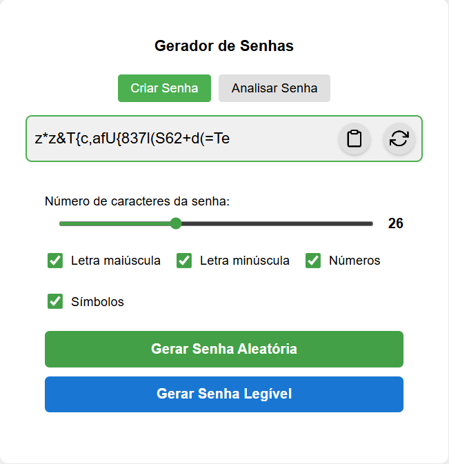
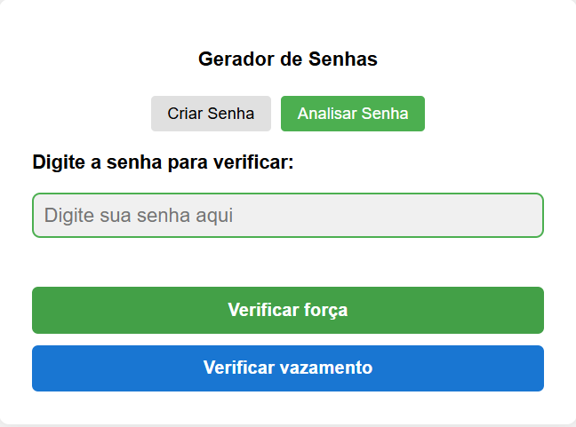

# 🔐 Gerador e Analisador de Senhas
[](https://codecov.io/gh/elissandro13/secure-password-generator)

Aplicação web simples e funcional para geração e análise de senhas seguras, desenvolvida com Node.js, Express, Jest, Supertest e Cypress. Permite personalizar senhas, verificar sua força e se foram vazadas. Ideal para estudo de boas práticas em desenvolvimento, testes automatizados e CI/CD com GitHub Actions.

---


## 👥 Membros do Grupo
- Elissandro Caetano Júnior
- Gustavo Henrique Gonçalves Viveiros
- Vitor Fagundes Alves Nogueira

---

## 🧠 Descrição do Sistema
Este projeto foi desenvolvido como parte do trabalho prático de Engenharia de Software II. O objetivo é demonstrar:

- Geração de senhas com parâmetros customizáveis.
- Geração de senhas legíveis (mais memorizáveis).
- Interface web moderna e responsiva.
- Análise de força da senha com base em critérios técnicos.
- Verificação de vazamento usando a API do Have I Been Pwned.
- Testes automatizados com Jest.
- Integração contínua com GitHub Actions em múltiplos sistemas operacionais.
- Registro da cobertura de testes no codecov.

---

## ✨ Funcionalidades Principais

### 🛠 Gerador de Senhas
- **Comprimento Personalizável:** Escolha entre 4 e 64 caracteres.
- **Composição da Senha:**
  - Letras maiúsculas (A-Z)
  - Letras minúsculas (a-z)
  - Números (0-9)
  - Símbolos (!@#$%^&*)
- **Modo Legível:** Gera senhas pronunciáveis e memorizáveis com sílabas + número + símbolo.
- **Cópia automática:** Um clique para copiar para a área de transferência.

### 🔎 Analisador de Senhas
- **Verificação de Força:** Baseada em tamanho, diversidade e complexidade da senha.
- **Verificação de Vazamento:** Usa a API pública do Have I Been Pwned (HIBP) para saber se a senha já foi exposta.



---

## 💻 Tecnologias Utilizadas
- **Node.js** – Backend JavaScript
- **Express.js** – Framework web
- **Jest** – Testes unitários
- **Supertest** - Testes de integração HTTP
- **Cypress** - Testes E2E automatizados
- **Codecov** - Análise de cobertura
- **HTML + CSS + JS** – Front-end
- **Axios** – Requisições HTTP para HIBP
- **GitHub Actions** – Integração e testes automáticos (CI/CD)

---

## 🚀 Como Executar o Projeto

**Pré-requisitos:**
- Node.js (v18 ou superior)
- Git

```bash
# 1. Clone o repositório
git clone https://github.com/elissandro13/secure-password-generator.git
cd secure-password-generator

# 2. Instale as dependências
npm install

# 3. Inicie o servidor
npm start

# 4. Acesse no navegador
http://localhost:3000
```

---

## 🧪 Como Executar os Testes

```bash
# Unit + Integration
npm test

# E2E
npm run cypress:open

# Cypress E2E + Unit
npm run test:all
```

---

## 📂 Estrutura do Projeto
```txt
secure-password-generator/
├── .github/workflows/          # CI/CD com GitHub Actions
│   └── node.js.yml
├── coverage/                   # Relatórios de cobertura de testes
├── images/                     # Imagens do sistema (documentação)
├── public/                     # HTML + CSS do front-end
│   ├── index.html
│   └── style.css
├── src/                        # Código-fonte backend
│   ├── app.js
│   ├── check-breach.js
│   ├── checkPasswordStrength.js
│   └── password.js
├── tests/                      # Testes com Jest
│   ├── check-breach.test.js
│   ├── checkPasswordStrength.test.js
│   └── password.test.js
├── cypress/
│   ├── e2e/
│   │   ├── password-generator.cy
│   ├── support/
│   │   ├── commands.js            # Comandos customizados
│   │   └── e2e.js                 # Configurações globais
├── .gitignore
├── cypress.config.js              # Configuração Cypress
├── LICENSE
├── package.json
├── package-lock.json
└── README.md
```
